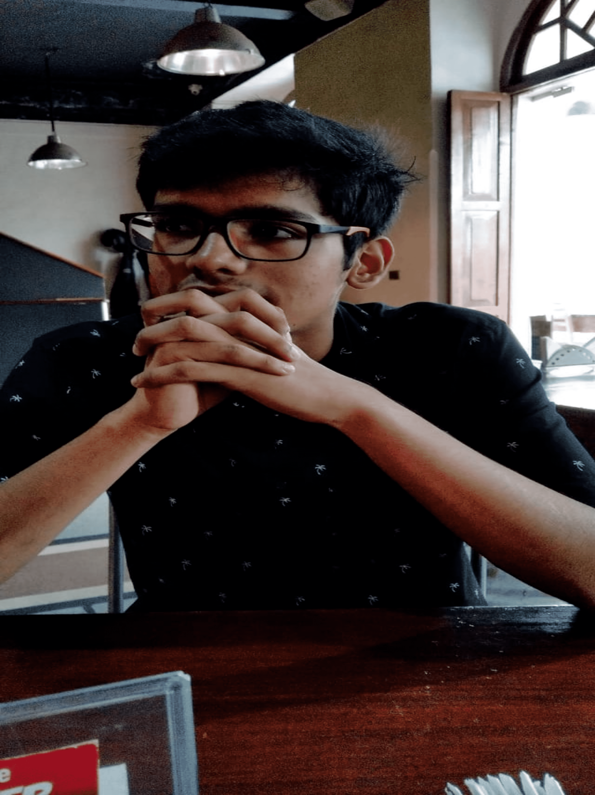

<!-- Main -->

<!-- One -->
<section id="one">
	

		<header class="major">
			<h1>Core Team 2020 - 2021</h1>
		</header>

<!-- Content -->
<h2 id="content">Meet the family ^_^ </h2>
<!--
Core team intro, duties etc
-->

	

		<h3>We are a body of 100+ students ! </h3>
		
 <a href="https://www.linkedin.com/in/abhishek-dixit-ba8497185">Abhishek Dixit</a>
			<a href="https://www.linkedin.com/in/vishal-singh-b51b52158/">Vishal Singh</a>
			<a href="https://www.linkedin.com/in/aditya-bidwai-27980016b/">Aditya Bidwai</a>
			<a href="https://in.linkedin.com/in/eash-vrudhula-a11b64170">Eash Vrudhula</a>
			<a href="https://www.linkedin.com/in/advait-kulkarni-5574b21aa">Advait Kulkarni</a>
			<a href="https://www.linkedin.com/in/shivangi-gupta-3429aa8b">Shivangi Gupta</a>
			<a href="http://www.linkedin.com/in/anirudha-shrinivas-87a3811b0">Anirudha Shrinivas</a>
			<a href="https://www.linkedin.com/in/mohit-chaudhari-759130171/">Mohit Chaudhari</a>		
		

	

	<!-- Break -->
	

		<h3>Atharv Sonwane</h3>
		
<a href="https://github.com/threewisemonkeys-as/">Chief Coordinator</a>

		
		 
		<a href="https://www.linkedin.com/in/atharv-sonwane-646413172/">Contact me !</a>
		

	

	

		<h3>Tanmay Bhonsale</h3>
		
<a href="https://www.instructables.com/member/DangerousTim/">Research Head</a>

			
			 
		<a href="https://github.com/DangerousTim">Contact me !</a>
		

	

	

		<h3>Vedant Shah</h3>
		
<a href="https://github.com/veds12">CTE Head</a> 

			
			 
		<a href="https://www.linkedin.com/in/vedant-shah-00547576/">Contact me !</a>
		

	

<!-- Elements -->
<h2 id="elements">Former Core members:</h2>

	

<!-- Table -->

	<table>
		<thead>
			<tr>
				<th>POR</th>
				<th>Name</th>
				<th>Contact Us</th>
			</tr>
		</thead>
		<tbody>
			<tr>
				<td>CTE Head</td>
				<td>Harshal Deshpande</td>
				<td><a href="https://hardesh.github.io/">Personal Portfolio</a></td>
			</tr>
			<tr>
				<td>Chief Coordinator</td>
				<td>Tejas Rane</td>
				<td><a href="https://www.linkedin.com/in/tejas-rane-359590149/">LinkedIn</a></td>
			</tr>
			<tr>
				<td>Sub Coordinator</td>
				<td>Rishikesh Vanarse</td>
				<td><a href="https://www.linkedin.com/in/rishikesh-vanarse-8032aa169/">LinkedIn</a></td>
			</tr>
			<tr>
				<td>Technical Head</td>
				<td>Prathmesh Thorwe</td>
				<td><a href="https://www.linkedin.com/in/prathmesh-thorwe-b76469153/">LinkedIn</a></td>
			</tr>
			<tr>
				<td>Mechanical Head</td>
				<td>Aditya Phopale</td>
				<td><a href="https://www.linkedin.com/in/aditya-phopale-666a7515b/">LinkedIn</a></td>
			</tr>
			<tr>
				<td>Research Head</td>
				<td>Mohit Gupta</td>
				<td><a href="https://www.linkedin.com/in/mohit-sushil-gupta-7a3821184/">LinkedIn</a></td>
			</tr>
		</tbody>
	</table>

