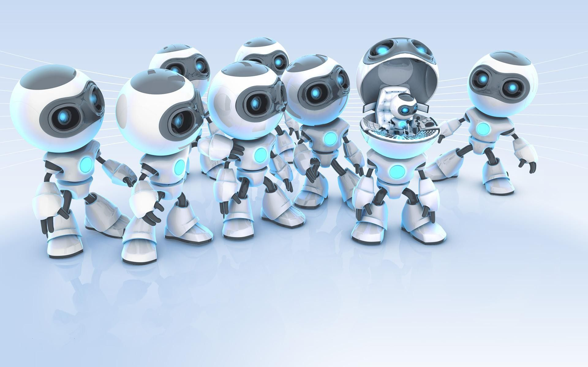

The electronics and Robotics Club of BITS Goa comprises fitness freaks to foodies, bookworms to non ghots all having the same interest, the love for robotics.
Contrary to the name, ERC welcomes not just electronics lovers but is a haven for mechanical and coding enthusiasts. Juniors work under the guidance of able team leaders along with a wide range of advanced lab equipment like 3D printers, plasma cutters, PCB milling machines and laser cutter, which enables the club not just to participate in several technical competitions held across the country but also to churn out numerous projects each year. However ERC's major highlight is undoubtedly the Quark Display Project. From projects like the Osaka clock, a 100*100*100 LED cube, a giant LED globe, ERC aims to go bigger and better every year.
