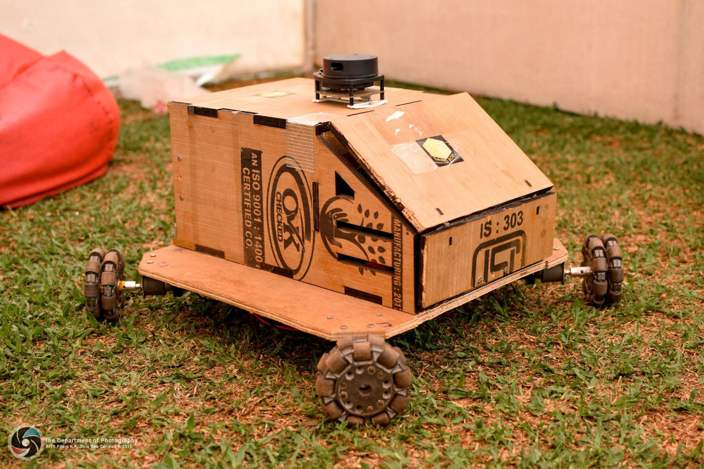
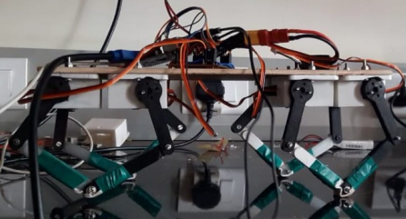
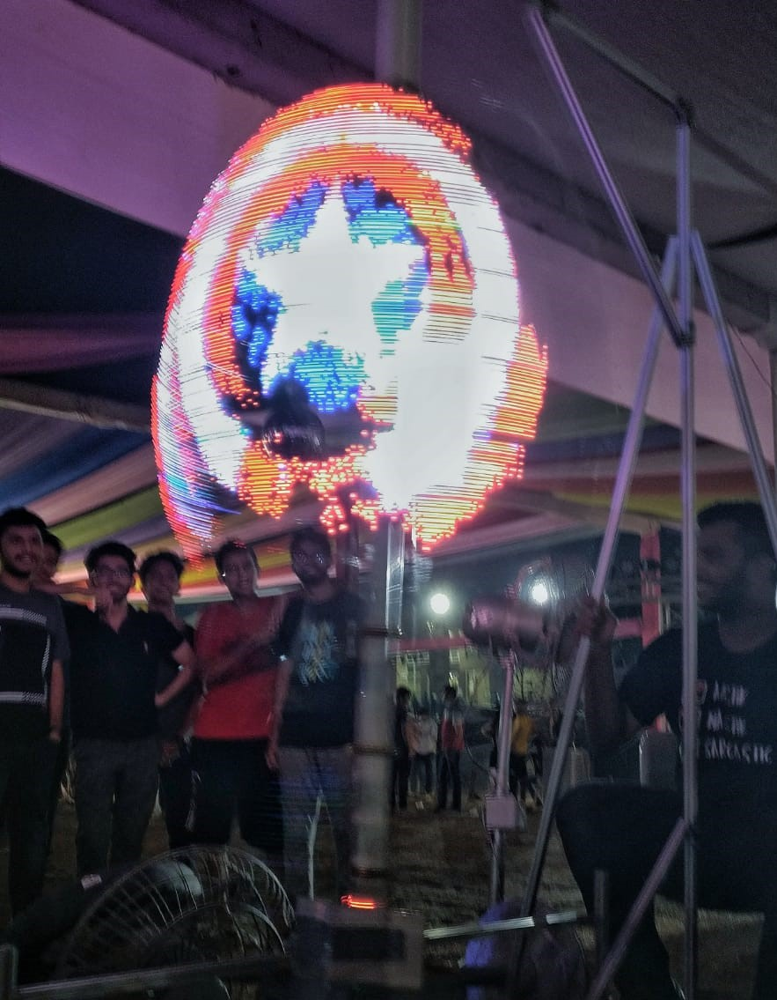
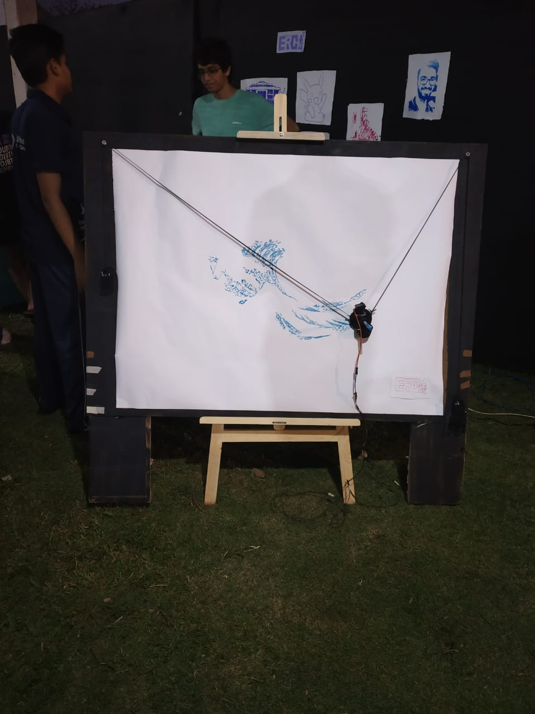

<!-- Main -->

<!-- Two -->
<section id="two" class="spotlights">
	<section>
		
		

			

				<header class="major">
					<h3>Trotbot</h3>
				</header>
				
Team Lead: Harshal Deshpande  
						Trotbot is a multipurpose robot, designed to serve autonomously in indoor environment. It can be used as follows:
						To deliver packages from one location to another in offices, construction sites,etc
						Can be teleoperated to nearby locations using the camera feed
						The robot will be able to autonomously navigate around obstacles and reach waypoints set in and around the environment with the use of onboard sensors and be able to detect it's location.
						Currently, we are looking at visual odometry as an alternative for mouse for localisation of the robot.	

				<ul class="actions">
					<li><a href="https://github.com/ERC-BPGC/Trotbot" class="button">GitHub Repo</a></li>
				</ul>
			

		

	</section>
	<section>
		
		

			

				<header class="major">
					<h3>Quadruped</h3>
				</header>
				
Team Lead: Mohit Gupta 
				The main objective is to mimic a four legged animal and get various gaits out of it like trot, bound, canter through open loop and closed loop methods. It will be further used as a platform for attachment of vision based system for mapping different terrains
				We have successfully deployed trotting walk on the quadruped. A ROS(Robot Operating System) package is also created. A static self-stabilizing PID controller using an IMU has been created and successfully deployed on the quadruped.
				Different gaits will be tested on the quadruped. A dynamic stabilizing strategy will be developed. Later, environment tracking using realsense depth camera will be developed.
				

				<ul class="actions">
					<li><a href="https://github.com/MohitGupta007/Quadruped_BPGC" class="button">Github Repo</a></li>
				</ul>
			

		

	</section>
	<section>
		
		

			

				<header class="major">
					<h3>Modbot</h3>
				</header>
				
Team Lead: Prathmesh Thorwe  
				Modular Robots are a system of individual modules capable of linking to each other to form reconfigurable structures suited for different purposes. This is useful when the task/environment of a bot is not known beforehand.
				The project aims to design, simulate and manufacture such modules with maximum DOFs possible for a highly flexible and robust system.
				

				<ul class="actions">
					<li><a href="https://github.com/rmvanarse/modbot2" class="button">GitHub Repo</a></li>
				</ul>
			

		

	</section>
	<section>
		
		

			

				<header class="major">
					<h3>LED Globe</h3>
				</header>
				
Team Lead: Mohit Gupta  
				LED Globe was the flagship display project from ERC for Quark 2019, the technical fest of BITS-Goa.
				The globe consisted of 2, 75 cm radius acrylic semicircular discs having LEDs along the perimeter of one of them. This setup was mounted vertically on a aluminium frame. The setup would be rotated using a high torque motor. The synchronised firing of LEDs created the illusion of an image.The programming that was involved allowed one to take any any image from the internet, divide it into a number of segments which the code could recognize and thus program the LEDs in that manner.
				
	
			

		

	</section>
<section>
		
		

			

				<header class="major">
					<h3>Sketcher</h3>
				</header>
				
Team Lead: Atharva Sonwane 
				Sketcher was one of the projects displayed in Quark 2020 by the Electronics and Robotics Club, BITS Goa. It is basically a full-scale prototype of a polargraph supporting multiple drawing styles such as stipples, Travelling Salesperson (implementation of the travelling salesperson problem to draw images), D2S,etc.
				<ul class="actions">
					<li><a href="https://github.com/ERC-BPGC/Sketcher" class="button">GitHub Repo</a></li>
				</ul>
			

		

	</section>
<!--
	<section>
		
		

			

				<header class="major">
					<h3>LED Octapad</h3>
				</header>
				
Team Lead: Abhishek Dixit 
				The LED Octapad is, at its heart, a MIDI controller, but specced up with 324 individually controlled RGB LEDs. This means the pads are dynamic, reacting in real time to your touch, while also sending MIDI signals to your computer to play, say a virtual drum machine, or a virtual piano.
				The project has 2 microcontrollers: One to handle the touch responses, and one to handle the precarious task of handling 300+ neopixels. We've used a teensy LC for the former.An UNO handles 6 separate strips of neopixels - one in each hexagon. Only one Adafruit_NeoPixel object is instantiated though, and different strips are handled using Adafruit_Neopixel.setPin() method. The strip is arranged concentrically inside each hexagon.
				<ul class="actions">
					<li><a href="https://github.com/ERC-BPGC/LED-Octapad" class="button">Github Repo</a></li>
				</ul>
			

		

	</section>
	-->
</section>

